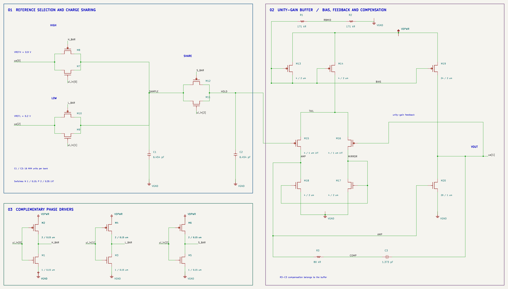
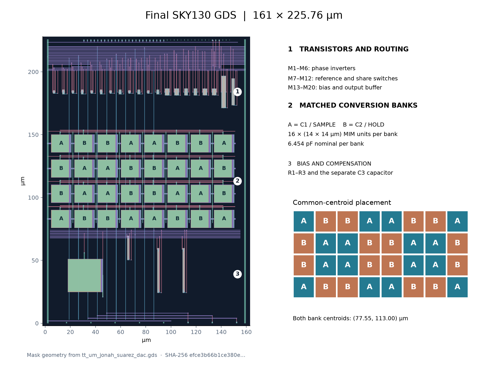
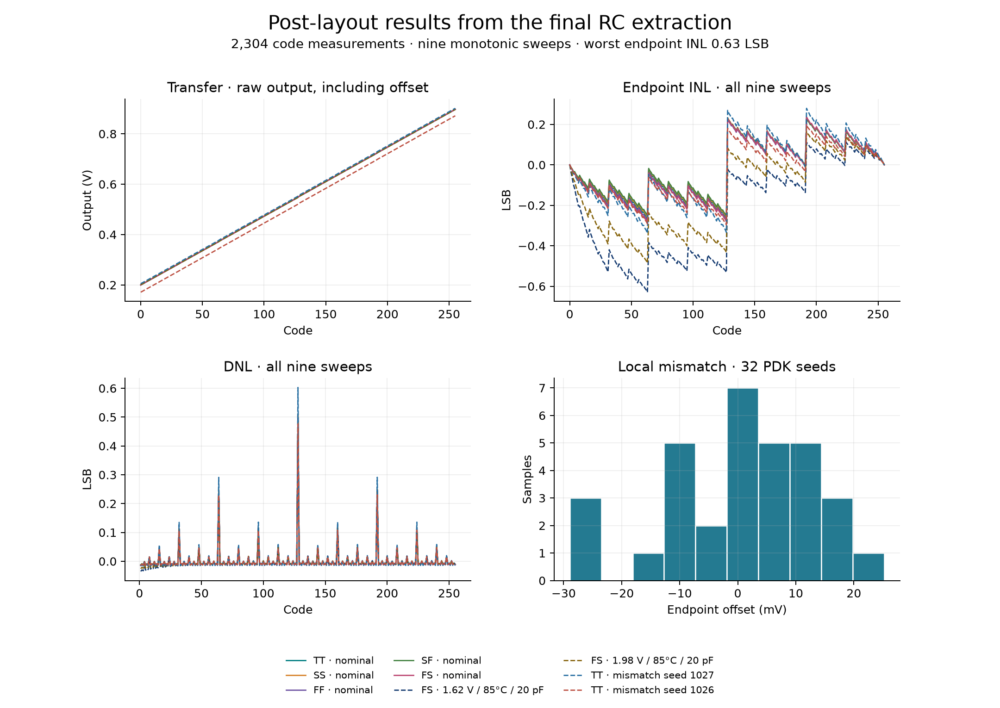
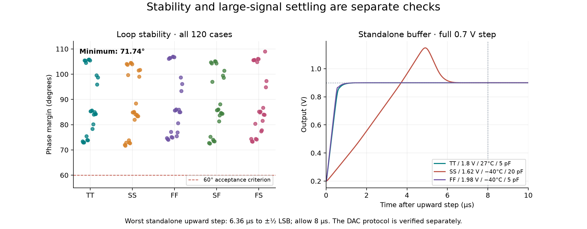

# Suarez serial two-capacitor DAC

[](https://github.com/jonahsaunders/tt_sky130_um_2_cap_DAC/actions/workflows/gds.yaml)
[](https://github.com/jonahsaunders/tt_sky130_um_2_cap_DAC/actions/workflows/docs.yaml)

An 8-bit serial charge-sharing DAC implemented in SKY130 for an experimental Tiny Tapeout analog submission. Two equal capacitor banks form the converter; a unity-gain buffer drives the analog output. This repository includes the editable circuit, physical layout, extracted simulations, and the evidence behind the reported results.

**Status:** native and GDS DRC/LVS, antenna checks, and all 15 official prechecks pass. The circuit is simulated; silicon has not been fabricated or measured. Precise absolute output voltage requires offset/gain calibration.

[Read the circuit guide](docs/architecture.md) · [Operate the DAC](docs/info.md) · [Inspect the test results](docs/testing.md) · [Open the interactive layout viewer](https://jonahsaunders.github.io/tt_sky130_um_2_cap_DAC/)

## The circuit



The signal flows from the reference selectors through **SAMPLE → SHARE → HOLD → buffer → VOUT**. C1 is charged to the next bit's reference, then shares its charge with C2. Repeating this operation least significant bit first gives the ideal transfer:

```text
VOUT = VREFL + (VREFH − VREFL) × code / 256
```

The complete buffer is drawn beside the conversion core, with its bias wire, feedback loop, and R3–C3 compensation connected visibly. The three inverters below the core generate complementary switch controls. C3 is a buffer compensation capacitor, separate from the two conversion banks.

[Full schematic PNG](schematic/suarez_dac.png) · [Printable PDF](schematic/suarez_dac.pdf) · [SVG](schematic/render/suarez_dac.svg) · [Editable KiCad project](schematic/suarez_dac.kicad_pro)

| Operating parameter | Qualified condition |
|---|---|
| Process / supply | SKY130A / 1.8 V nominal; 1.62 and 1.98 V boundaries modeled |
| Footprint | 161 × 225.76 µm; 1 × 2 analog tiles |
| Conversion | Eight bits, LSB first; three external phase controls |
| Reference voltages | VREFL = 0.2 V; VREFH = 0.9 V |
| Conversion banks | C1 = C2 = 6.454 pF nominal; 16 MIM units each |
| Word interval | 46.9 µs with the supplied sequence; about 21.3 kwords/s |
| Output measurement load | 5–20 pF and at least 10 MΩ |

## The physical layout



The 32 conversion-capacitor units are interleaved as two banks with the same centroid. The upper device row contains the phase drivers, transmission gates, bias devices, and buffer. The lower region contains the bias resistors and compensation components. Ground shields limit SAMPLE/HOLD coupling. The diagram is rendered from the delivered GDS; the A/B labels come from the layout generator's placement data.

[Interactive GDS viewer](https://jonahsaunders.github.io/tt_sky130_um_2_cap_DAC/) · [Unannotated layout image](layout/suarez_dac_layout.png) · [GDS](gds/tt_um_jonah_suarez_dac.gds) · [LEF](lef/tt_um_jonah_suarez_dac.lef) · [Native Magic layout](layout/tt_um_jonah_suarez_dac.mag)

## What the tests show



All nine complete 256-code sweeps are strictly monotonic: **2,304 measured code points** from the final RC extraction. The worst endpoint INL is **0.63 LSB**. Endpoint INL removes offset and gain; the raw transfer curves retain them. The offset distribution is why calibration is part of the operating procedure.

| Check | Coverage / result | Evidence |
|---|---|---|
| Physical correctness | Native/GDS DRC: zero errors; both LVS comparisons uniquely match; antenna: zero feedback entries | [Physical report](verification/physical_checks.json) |
| Tiny Tapeout integration | All 15 official prechecks pass | [Precheck report](verification/precheck/results.md) |
| Schematic | Zero ERC violations; all 72 device connections match the specification | [Connectivity report](verification/schematic_connectivity.json) |
| Complete code sweeps | Nine × 256 codes; all monotonic; INL ≤ 0.63 LSB | [Every code measurement](verification/all_code_results.csv) |
| Additional PVT / mismatch | 30 PVT conditions and 32 local-mismatch seeds, ten selected codes each | [Qualification report](verification/verification.md) |
| Stability | 120 cases; minimum phase margin 71.74° | [Test guide](docs/testing.md#stability-and-settling) |
| Untrimmed endpoint offset | −28.94 to +25.24 mV over 32 modeled seeds | [Calibration and limits](docs/testing.md#calibration-and-limits) |



The standalone buffer's worst full 0.7 V upward step takes **6.36 µs** to settle within half an LSB and overshoots by about **248 mV**. Allow 8 µs for that test. The actual DAC sequence is separately verified with a 3 µs read delay after the last bit. These modeled results establish feasibility within the tested conditions; they do not establish measured ENOB or manufacturing yield.

[Detailed test guide](docs/testing.md) · [Full qualification report](verification/verification.md) · [Machine-readable summary](verification/summary.json)

## Connect and operate

| Port | Signal | Connection |
|---|---|---|
| VDPWR / VGND | Supply / ground | 1.8 V nominal |
| ui_in[0] | CHARGE_HIGH | 1.8 V phase signal |
| ui_in[1] | CHARGE_LOW | 1.8 V phase signal |
| ui_in[2] | SHARE | 1.8 V phase signal |
| ua[0] | VREFH | Low-impedance 0.9 V reference |
| ua[1] | VOUT | High-impedance measurement input |
| ua[2] | VREFL | Low-impedance 0.2 V reference |

Initialize both banks to VREFL for 8 µs, then transmit eight bits LSB first. Each bit uses 2 µs charging, 0.2 µs dead time, 2 µs sharing, and 0.2 µs dead time. Read 3 µs after the final bit. HIGH and LOW never overlap; LOW and SHARE overlap only during initialization. The external controller supplies dead time. `clk`, `ena`, and `rst_n` do not sequence the circuit.


[Full operating instructions](docs/info.md) · [Controller and two-point calibration example](examples/phase_driver.py)

## Work with the design

| Task | Start here |
|---|---|
| Understand the stages and device roles | [Circuit guide](docs/architecture.md) |
| Understand coverage, accuracy, and limitations | [Test guide](docs/testing.md) |
| Rebuild, verify, or regenerate the images | [Reproduction guide](docs/reproducing.md) |
| Edit the schematic | [KiCad schematic](schematic/suarez_dac.kicad_sch); embedded symbols and local library included |
| Edit the silicon layout | [Magic top cell](layout/tt_um_jonah_suarez_dac.mag); retain adjacent device cells |
| Inspect the electrical implementation | [Circuit SPICE](netlist/tt_um_jonah_suarez_dac.spice) and [extracted RC SPICE](netlist/tt_um_jonah_suarez_dac.rc.spice) |
| Check provenance and release bytes | [Tool versions](verification/provenance.json) and [SHA-256 manifest](manifest.json) |

The design uses IIC OSIC Tools for layout and simulation, and native KiCad 10 exports for the schematic. In the configured tool shell, with this repository mounted at `/foss/designs`, the principal commands are:

```sh
python3 scripts/build_circuit.py
python3 scripts/build_layout.py
# Set TT_SUPPORT_TOOLS to your TinyTapeout/tt-support-tools clone first.
bash scripts/verify.sh
python3 scripts/render_docs.py
```

See the reproduction guide for schematic exports, dependencies, and the difference between local simulation qualification and GitHub integration checks. Saved simulation decks record their original mount paths; regenerate cases before rerunning them in a new checkout.

GitHub Pages must use **Settings → Pages → GitHub Actions** for the viewer to publish. This is enabled in this repository. For a fork, enable it before the first run. If a retry reports duplicate `github-pages` artifacts, start a fresh run using **Run workflow**.
