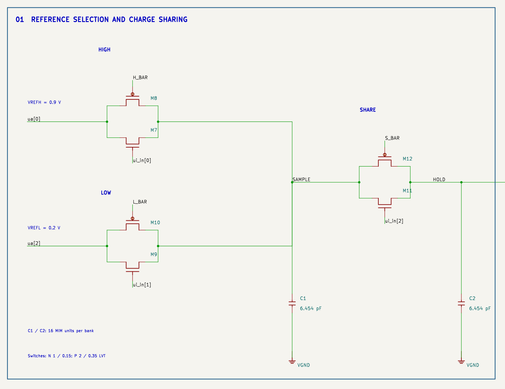
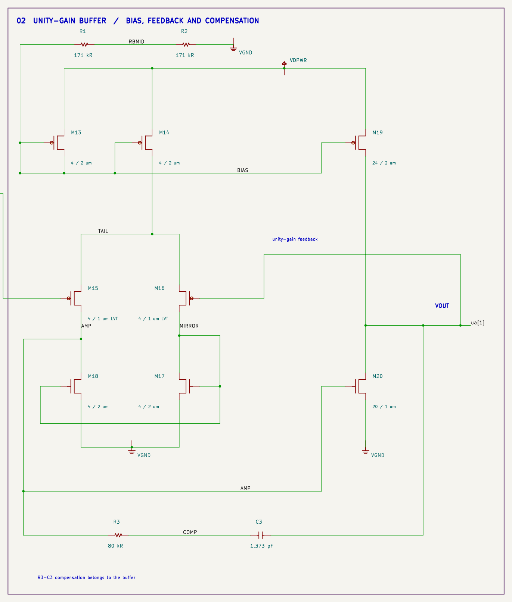
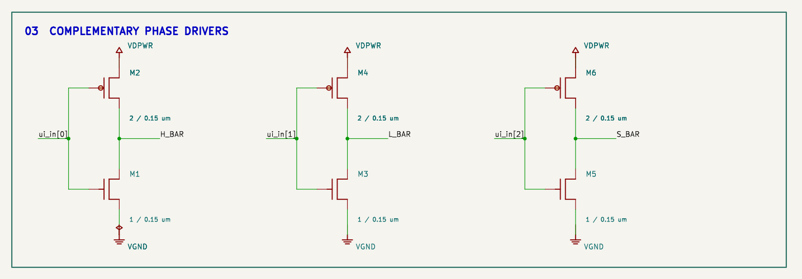

# Reading the circuit

[Back to the README](../README.md) · [Operating instructions](info.md) · [Test results](testing.md)


The drawing follows the stored charge from left to right. The reference selectors feed C1, the SHARE switch joins C1 to C2, and the buffer senses C2 without letting the output pad discharge it. The bias, output driver, feedback, and compensation belong to one amplifier and are shown together.

## Reference selection and the two banks



M7/M8 connect VREFH to SAMPLE when HIGH is asserted. M9/M10 connect VREFL when LOW is asserted. Each pair is a CMOS transmission gate: the NMOS receives the phase signal and the PMOS receives its complement. The PMOS switches use the low-threshold model to preserve transfer at low supply and cold temperature.

C1 stores the selected reference. With both reference switches open, M11/M12 connect SAMPLE to HOLD during SHARE. C1 and C2 have equal nominal capacitance, so their ideal shared voltage is the average of the old held voltage and the selected reference:

```text
Vhold,next = (Vhold,previous + Vref,bit) / 2
```

Initialize both banks to VREFL, then process bits b0 through b7. Each later bit contributes twice the weight of the previous bit, giving `VREFL + (VREFH − VREFL) × code / 256`. Code 255 ideally reaches 0.897265625 V for the fixed 0.2/0.9 V references.

The silicon contains 16 MIM units per conversion bank. The schematic combines those units into C1 and C2; each bank is nominally 6.454 pF. C3 is a separate amplifier compensation capacitor.

## The complete output buffer



M13 and R1/R2 establish BIAS. M14 supplies the PMOS input pair M15/M16, while M17/M18 form its NMOS current-mirror load. M15 senses HOLD; M16 senses VOUT through the visible feedback loop. The first-stage output is AMP.

AMP drives M20, and M19 supplies the output-stage current from the same BIAS wire. R3 and C3 connect AMP to VOUT and compensate this two-stage amplifier. The buffer is configured for unity gain and is always powered. Its small untrimmed input pair produces enough modeled offset that precise absolute voltage requires two-point calibration.

| Node | Meaning |
|---|---|
| SAMPLE | Reference-charged C1 bank |
| HOLD | C2 stored output; buffer input |
| BIAS | Shared bias for M14 and M19 |
| TAIL | PMOS differential-pair current-source node |
| MIRROR | Diode-connected NMOS load reference |
| AMP | First-stage output; M20 gate |
| COMP | R3–C3 series connection |
| ua[1] | Buffered VOUT and feedback input |

The visible MOS symbols have D/G/S pins numbered 1/2/3. All NMOS bodies are tied to VGND and all PMOS bodies to VDPWR in the circuit netlist and layout. These body connections remain explicit in SPICE. The symbols include model and geometry properties and have no PCB footprints because the devices are on chip.

## Phase controls



M1/M2 generate H_BAR, M3/M4 generate L_BAR, and M5/M6 generate S_BAR. These are ordinary complementary inverters. They do not provide dead time or sequence a word; the controller must supply that timing. Phase labels link these drivers to the corresponding transmission-gate gates.

HIGH and LOW must never overlap. During conversion, SHARE is low while either reference selector charges C1. The deliberate LOW/SHARE overlap during initialization resets both banks to VREFL. The [timing instructions](info.md#how-to-test) describe that exception.

## From the drawing to silicon


The A/B pattern is `ABBAABBA / BAABBAAB / BAABBAAB / ABBAABBA`, with A = SAMPLE and B = HOLD. Both bank centroids are at (77.55, 113.00) µm. Interleaving balances a linear spatial gradient; it does not prove immunity to all capacitor variation. Ground shields reduce coupling between stored nodes.

The macro has 20 MOS devices, three resistors, and 33 physical MIM capacitors: 32 conversion units plus C3. It occupies 161 × 225.76 µm, uses three analog pads, has full-height metal-4 power stripes, and uses no metal 5. Unused digital outputs and bidirectional output enables are grounded; unused analog pads are isolated.

[Open the interactive layout viewer](https://jonahsaunders.github.io/tt_sky130_um_2_cap_DAC/) or download the [GDS](../gds/tt_um_jonah_suarez_dac.gds). [Schematic connectivity](../verification/schematic_connectivity.json), native/GDS LVS, and the physical reports tie these views to the same circuit.
